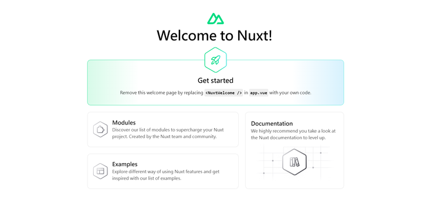

# \[ Nuxt ] Nuxt 安裝流程
## 環境需求
* Node：`v18.0.0` 或更新的版本
* 文字編輯器：Nuxt 官方推薦 VS Code + ​Vue - Official 原 Volar 套件(已停用)

**額外補充**

* Node.js: 使用偶數號的版本 (例如: 18、20)
* Nuxtr: <a href='https://marketplace.visualstudio.com/items?itemName=Nuxtr.nuxtr-vscode' target='_blank'>Nuxtr extension</a>

## 開始安裝
> 有 npx / pnpm / bun 三種可選，以下使用 npx 和 npm

1. 建立初始專案 (記得更改 project name)
```js
npx nuxi@latest init <project-name>
```

下指令後，它會問你要用哪種套件管理工具: npm pnpm ... 等自選
耐心等它跑完
跑完後會問你要不要初始化 git repo (真貼心)

2. 以編輯器開啟
```js
code <project-name>
```

3. 切換到專案資料夾
```js
cd <project-name>
```
4. 安裝相依的套件和模組
```js
npm install
```
5. 開啟專案
```js
npm run dev -- -o
```

成功建立 👏🏻👏🏻👏🏻👏🏻



#### 參考資料
* <a href='https://nuxt.com/docs/getting-started/installation#prerequisites' target='_blank'>Nuxt - Installation</a>