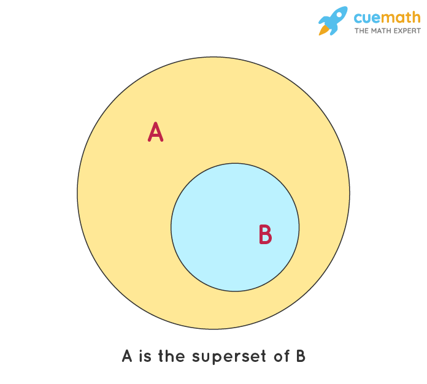

# TypeScript | 什麼是 TypeScript
TypeScript (TS) 是 JavaScript 的一個超集，在 JavaScript (JS) 的基礎上提供了**型別系統**和對 ES6 的支援。TS 會編譯成純 JS，確保與任何運行 JS 的環境（包括瀏覽器、伺服器和任何作業系統）兼容。TS 有靜態型別檢查器，在編譯階段 (執行前) 就先抓出可能的錯誤或型別錯誤，如下範例。
```JS
const obj = { width: 10, height: 15 };
const area = obj.width * obj.heigth; // obj.heigth 拼法錯誤
// Property 'heigth' does not exist on type '{ width: number; height: number; }'. Did you mean 'height'?
```

> 備註：什麼是超集 (superset)? 超集 (superset)是一種集合，它包含了另一個集合的所有元素。換句話說，如果集合 A 是集合 B 的超集，那麼集合 B 的每個元素都屬於集合 A。{width="50%"}


#### 參考資料
* [什麼是 TypeScript | TypeScript 新手指南](https://willh.gitbook.io/typescript-tutorial/introduction/what-is-typescript){target="_blank"}
* [TypeScript: Documentation - TypeScript for the New Programmer](https://www.typescriptlang.org/docs/handbook/typescript-from-scratch.html){target="_blank"}