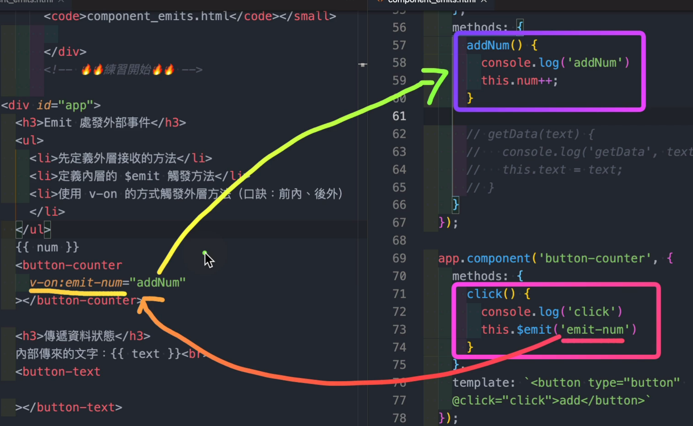

# JavaScript | 型別轉換與比較
> 來源：<a href="https://www.youtube.com/live/kX3madakVl0?si=0or9LZRicA2dHFBS" target="_blank">JavaScript 型別篇 - JS 面試常見核心知識</a>

## 型別轉換
### 顯性
#### 原始型別包裹物件
```js
console.log(typeof Number('1'))​;
```
#### 原形方法
```js
const number = 1;
console.log(typeof number.toString());
```
原形方法可以透過 `new Number()` 展開 prototype 來查看，其他原始型別也是使用同樣的方式。



#### 一元運算子
* 轉數值
```js
console.log(+ '1');
console.log(+ true);
console.log(- true);
```
* 邏輯運算子
`!` 表示 not
```js
console.log(!0); // true
console.log(!1); // false

console.log(!!1); // true
```
---
### 隱性
#### +運算子 (二元運算子)
* 規則一：前後運算元其中之一為 "字串"型別，+視為字串運算子
* 規則二：前後運算元如果無法轉型為原始型別 (就是指物件型別)，+視為字串運算子。
* 規則三：上述情況外，+視為算數運算子。
* BigInt 和 Number 型別不能混合運算
* Symbol 不能轉型
總結：前後運算元其中一個是字串或物件型別，+ 視為字串運算子。

```js
console.log(1 + 1); 
​console.log('這是' + '一句話');
console.log(1 + true);

// 2
// '這是一句話'
// 2​
```
```js
console.log(1 + '這是一句話');
console.log(true + true);

// '1這是一句話'
// 2
```
物件型別會被套用 String() 轉型

`String({})` ➡️ `'[object Object]'`
`String([])` ➡️ `''`

```js
console.log(1 + {});
console.log([1]);
console.log(1 + [1]);
console.log(1 + [1, 2]);

// 1[object Object]
// '1'
// '11'
// '11,2'
```
```js
console.log(1n + 3n);
console.log(100n * 100n);
console.log(1 + 1n);

// 4n​
// 10000n​

// 報錯：uncaught typeError:
// - cannot mix BigInt and other types, use explicit conversions
```
```js
console.log(typeof Symbol(1))​;
console.log(Symbol(1) + 1)​; // 規則三
console.log(Symbol(1) + true)​; // 規則三
console.log(Symbol(1) + null)​; // 規則三
console.log(Symbol(1) + 1n)​; // 規則三
// Uncaught TypeError: Cannot convert a Symbol value to a number


console.log(Symbol(1) + {})​; // 規則二
// Uncaught TypeError: Cannot convert a Symbol value to a string


console.log(Symbol(1) + '123')​; // 規則一
// Uncaught TypeError: Cannot convert a Symbol value to a string
```

## 型別比較
<a href="https://dorey.github.io/JavaScript-Equality-Table/" target="_blank">型別寬鬆和嚴格比對表</a>

### === 嚴格比較
```js
console.log(NaN === NaN);

// false
```

物件型別相比會是 false。因為當使用 `===` 進行比較時，將檢查這兩個物件是否具有相同的參考（是否指向內存中的同一位置）。

以 `[] === []`為例，每個空陣列字面量 `[]` 都會創建一個全新的陣列物件，分別存在記憶體中的不同位置，具有不同的參考。所以就算這兩個陣列在結構上（即內容和順序）完全相同，它們也是兩個獨立的物件。`[] === []` 實際上是在比較兩個指向不同記憶體位置的參考，因為它們的參考不同，結果為 `false`。
```js
console.log({} === {});
console.log([] === []);
console.log(new Number(1) === new Number(1));

// false
// false
// false
```
```js
console.log(+0​ === -0);

// true
```

### == 寬鬆比較
`==` 在比較兩個值之前，會**先強制轉換**型別與值。

#### Number、String、Boolean 
這三者進行比較時，都使用 Number 來轉型。
```js
console.log(1 == true)​;
console.log(3 == true)​;

// true​
// false，因為 true 轉型後 Number(true) 會是 1
```

#### null、undefined
不轉型，跟其他值相比都是 false，但 null 和 undefined 相比會是 true
```js
console.log(null == undefined)​;

//​ true

console.log(null == 0)​;
console.log(undefined == 0)​;
console.log(undefined == '')​;

// false
// false
// false
```

#### BigInt 
轉型為 「數學值」，沒有 NaN、沒有小數點、沒有最大值

其他概念和 Number 接近
```js
console.log(1 == 1n);
console.log(1 === 1n);
console.log(9007199254740991 == 9007199254740991n);
console.log(9007199254740993 == 9007199254740993n); // 超出最大安全數，不精準

// true​
// false​
// true
// false
```

#### 物件和非物件比較
物件和其他型別比較，會透過「包裹物件」來把物件轉成相同的型別

例外：
* 布林會用 Number 轉型 (不是使用 Boolean 轉型)
* 陣列轉數值，會先 toString 再套用 Number
```js
console.log({} == 'object Object');
console.log({} == 1);
console.log({} == '1234');
console.log([1] == true);

// true​
// false
// false
// true​
```
```js
console.log([] == 0);

// 先 toString 再套用​ Number，[] 會變成 0
// true

console.log([1] == 1);

// true

console.log([1, 2] == 12);

// 先 toString 再套用​ Number，[1, 2] 會變成 NaN
// false​
```

### Object.is 同值比較
比較任意兩個值是不是相等。
```js
console.log(Object.is(1, 1)); 
console.log(Object.is(1, "1")); 

// true
// false
```
NaN/NaN 和 +0/-0 的比較問題，可以透過 `Object.is` 來分辨。另外，分辨 `NaN` 也可以使用 `Number.isNaN`。
```js
console.log(Object.is(+0, -0)); 
console.log(Object.is(NaN, NaN)); 

// false
// true


console.log(Number.isNaN(NaN)); 
console.log(Number.isNaN('NaN')); 

// true
// false，Number.isNaN 不會將 字串 NaN 視為NaN
```

#### 參考資料
* <a href="https://www.youtube.com/live/kX3madakVl0?si=74DvNQi9WF1eAaWq" target="_blank">JavaScript 型別篇 - JS 面試常見核心知識</a>
* <a href="https://www.explainthis.io/zh-hant/swe/js-equality" target="_blank">在 JavaScript 當中，==、=== 與 Object.is()的區別</a>
* chatgpt