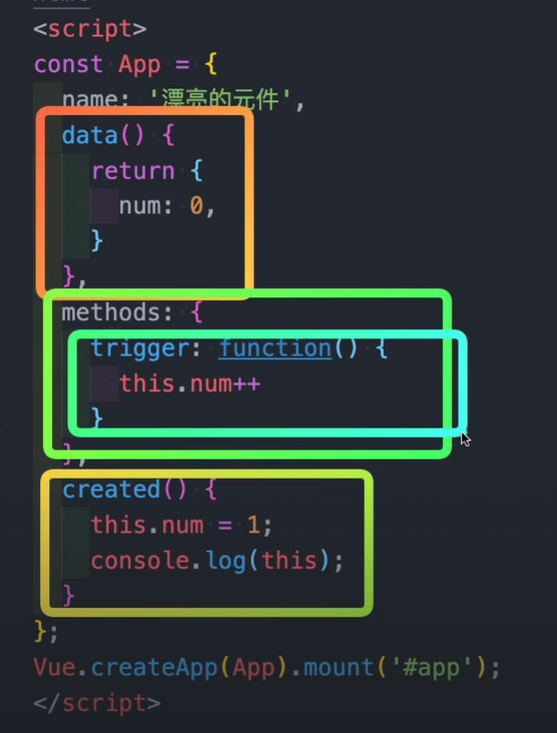
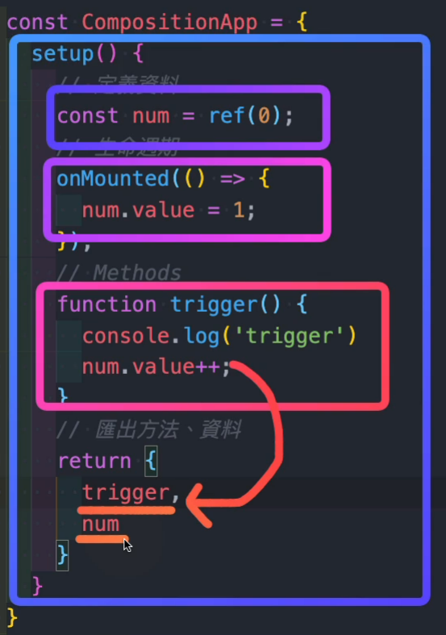

# Vue | Options API v.s. Composition API
## Options API
通過一組明確的選項（data, methods, computed 等）組織程式碼。
- 會把資料、方法、生命週期...等分門別類
- 較容易學習 → 適合新手
- 結構簡單直觀，適合小型項目或新手入門
- 在大型項目中，相關邏輯分散在不同選項中，難以維護

## Composition API
所有資料方法生命週期全部放在 setup 裡面，沒有順序上的差異

- 把需要匯出的資料放在 return 裡面，例如：資料要渲染在畫面上
- 比 options API 困難，撰寫風格較自由
- 邏輯更好重複利用，更容易管理大型項目
- 學習曲線較陡峭
- 生命週期語法變成 on 開頭

#### 參考資料
* chatgpt
* 六角學院影片