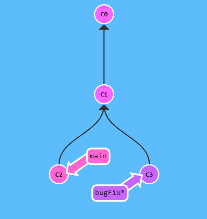
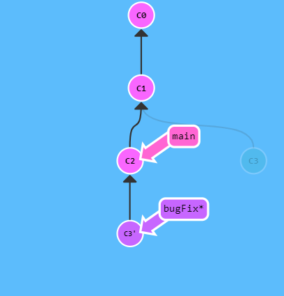

# Git | rebase
rebase 是 merge branch 的第二種方法。rebase 就是取出一連串的 commit，"複製"它們，然後把它們接在別的地方。

rebase 的優點是可以建立更線性的 commit history。假如只允許使用 rebase 的話，則我們的 repo 中的 commit log 或者是 commit history 會更加簡潔好看。

## 範例
目標 1：想要把在 bugfix 所做的修改直接移到 main 分支上。

當我在 bugFix 分支下指令 `git rebase main`，就會將目前分支 (bugFix) 的修改移到 main 分支上。

bugFix 分支上的工作在 main 分支的最前端，同時我們也得到了一個更加線性的 commit 順序。

備註：本來的 commit C3 沒有消失（在圖上面呈現陰影），我們"複製"了 C3，將它的副本 C3' 接在 main 分支的後面。

目標 2：更新 main 分支
使用 `git checkout main` 指令切換到 main 分支，再透過 `git rebase bugFix` 更新 main 分支，它只是把 main 分支往前移動到 bugFix 上。

