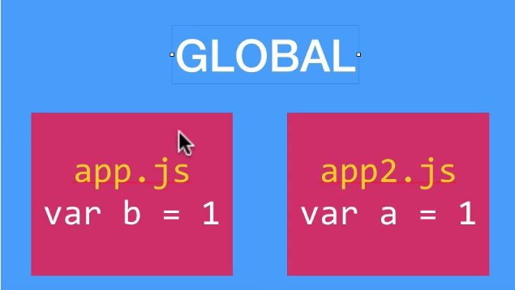

# \[ Node ] Global 物件和模組

## window 和 global 的差別
我們在 chrome console 寫程式碼時，會有 window 物件 (全域)，而在 Node.js (以下簡稱 node) 也會有全域 global 物件。

在 VS Code 打以下程式碼來觀察，可以看到 global 物件包含 a。
```js
global.a = 1;
console.log(global);​
```

node 的 global 跟瀏覽器 window 有一些差別，如果我們在瀏覽器 console 打 `var a = 1`，在 window 可以直接讀取到 a 變數，但在 node 輸入 `var a = 1`，不會被繼承到 global 上，想放在 global，一定要寫 global.a。每個檔案都是一個獨立的模組，一樣可以讀取、寫入和變更 global 的值，但各自的值不會輕易汙染 global 的值。



## 模組化
每個檔案都是獨立模組，例如：我創建了兩個檔案 app.js 和 data.js，分別輸入 `var a = 1` 和 `var data = 2`，但在 app.js 無法讀取到 data 的值，那我需要取得其他模組該怎麼辦?

跟 ES6 的匯入匯出概念很像，被匯出的檔案需要 export + 資料，在目標地匯入使用 import + 路徑。node 則是被匯出的檔案加上 module.exports + 資料，在目標地匯入使用 require + 路徑。

app.js 檔
```js
var content = require('./data');
var a = 1;

console.log(a);
console.log(content);
console.log(content.data);
console.log(content.bark()); // 執行匯入的函式
```

data.js
* 依照需求來設計匯出的資料格式
```js
var data = 2;

module.exports = data;

// or 
module.exports = {
	content: data,
	title: 'title',
};

// or 
exports.data = 2;
// 等同於
module.exports = {
	data: 2,
};

// or​ 
exports.bark = function() {
	return 'bark!!!'
}​
```

## exports 寫法不混用
exports 和 module.exports 兩種不能混用，exports 會被 module.exports 覆蓋。
```js
exports.bark = function() {
	return 'bark!!!'
}

module.exports = {
	data: 2,
};
```

#### 參考資料
* 六角學院影片