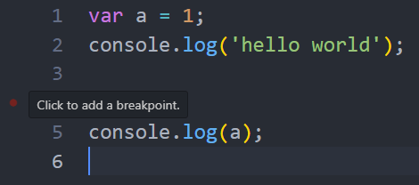

# Node | 簡單測試 Node.js
## 在終端機試玩
在終端機打 node，會跳出訊息和 >，就可以開始嘗試打一些 JavaScript 語法玩玩看了，就跟我們在瀏覽器 console 打指令一樣。

想要退出環境，鍵盤按 ctrl + C 或 ctrl + D 或 輸入 `.exit`。

## 執行 JS 檔
1. 開啟一個新的資料夾，在裡面新增 app.js 檔案，輸入 `console.log('hello world')`，儲存檔案
2. 打開終端機
3. 切換到 JS 檔案的資料夾 `cd 資料夾路徑`
4. 輸入指令 `node 檔案名稱`
5. 終端機會顯示執行結果 `'hello world'`

## 怎麼除錯? VS Code debug
在 VS Code 除錯可以善用 VS Code Debug 功能。

1. 用 VS Code 打開檔案
2. 點擊左側的蟲蟲按鈕開啟 debug 介面
3. 點擊 run and debug 按鈕，會在下方的 debug console 顯示結果或錯誤訊息
4. 滑鼠在程式碼行數數字的左側 hover，可以看到有紅色小圓點
5. 點擊後就可以在該行程式碼設置斷點，執行 debug 就會在這些斷點依序停住，方便我們查看當下的變數狀態，協助判斷為何程式碼不如預期

#### 參考資料
* 六角學院影片