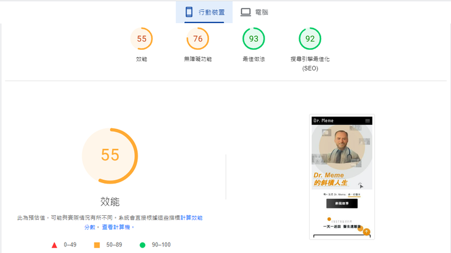
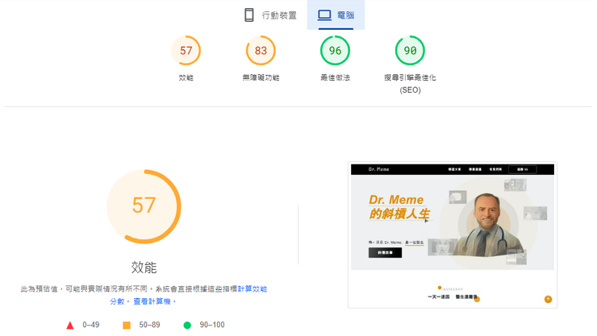
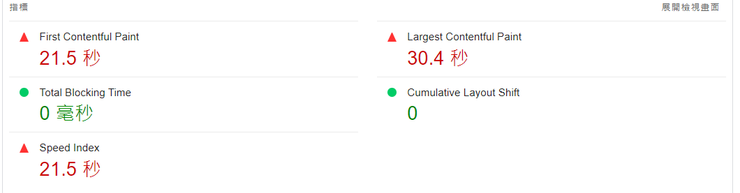
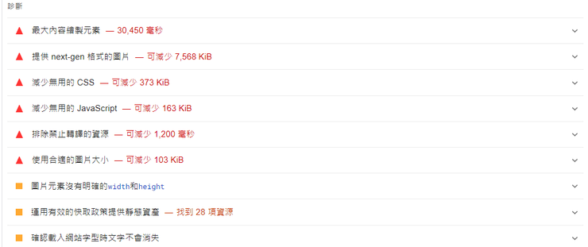
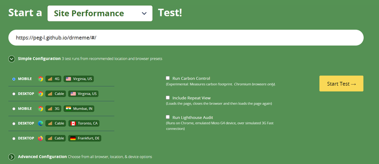

# \[ 效能優化 ] 網站效能優化工具

>【shout out to 莫力全✨[今晚，我想來點 Web 前端效能優化大補帖！](https://ithelp.ithome.com.tw/users/20113277/ironman/3877){target="_blank"}】 
> 讀後重點整理 & 重述 & 一點點自己的補充

## 評估網站效能
要怎麼評估一個網站的效能呢？
只靠自我感受? (X)
考慮網速慢的環境 + 搜尋引擎判斷效能 (O)

單看上面的考量點還是會不知道實際該怎麼去判斷，對吧? 莫急莫荒莫害怕，已經有幾個檢測網站的工具可以使用了，它們使用一些**特定且公認的指標**來檢測網站的效能。

* [Google PageSpeed Insights](https://pagespeed.web.dev/){target="_blank"}
* [WebPageTest](https://www.webpagetest.org/){target="_blank"}
* [Lighthouse](https://chromewebstore.google.com/detail/lighthouse/blipmdconlkpinefehnmjammfjpmpbjk?hl=zh-TW){target="_blank"}

## 評估工具
### [Google PageSpeed Insights](https://pagespeed.web.dev/?hl=zh-TW){target="_blank"}

輸入需要檢測的網址就 OK 囉。

首先輸入 Vue 專題網址。好的，不出意料。分數非常非常的低... 
在行動裝置和電腦分別獲得 55 和 57 分🥹🥹，無障礙功能分數也還有不小的改善空間。因為資料不會存在 Google 帳號中，測完後想要留資料，可以收藏存在網頁書籤，或複製連結存放，。

除了總分以外，也提供了各項指標的速度和一系列的診斷項目建議 (只截部分作為展示)。

PageSpeed 背後其實也是根據 Lighthouse 分析的研究資料計算出分數的。LH extension 資料比較完整和多元，相對的，使用方式比較不方便。LH 除了 extension，也有 devtool 工具，可以直接測用本地端開啟的網頁，就不用一直重新 deploy。

### WebPageTest
WebPageTest 最大的優勢就是「可以輕鬆檢測網站在不同瀏覽器下的狀況」。一樣輸入網站網址就 OK 了，環境部分可以選擇他預設的，或是進階設定成自己需要的。

### Google Lighthouse
莫大最常使用也最推薦的工具，介面圖表與網站檢測後的資訊都十分完整，除了效能以外，還提供如 Accessibility、Best Practices、SEO，還可以檢測是不是符合 PWA 的標準。

> chatgpt 解釋：PWA 指的是「Progressive Web App」，是一種結合網頁和原生應用程式功能的應用程式開發方法。PWA 允許開發者建立具有快速載入速度、離線工作能力、推送通知等特性的 Web 應用程式，同時提供類似原生應用程式的使用者體驗。

#### 2 種使用方法
1. 安裝 [Lighthouse Chrome Extension](https://chromewebstore.google.com/detail/lighthouse/blipmdconlkpinefehnmjammfjpmpbjk?hl=zh-TW){target="_blank"}
2. 使用 Devtool 的 Lighthouse

### lighthouse-ci
最後有補充將 lighthouse 結合 CI/CD workflow，有興趣可以點擊下面連結查看完整文章。

#### 參考/學習資源
* [Day03 X Performance Analyzers feat. Lighthouse-CI](https://ithelp.ithome.com.tw/articles/10266656){target="_blank"}