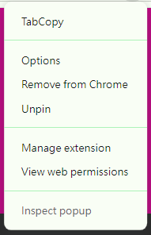
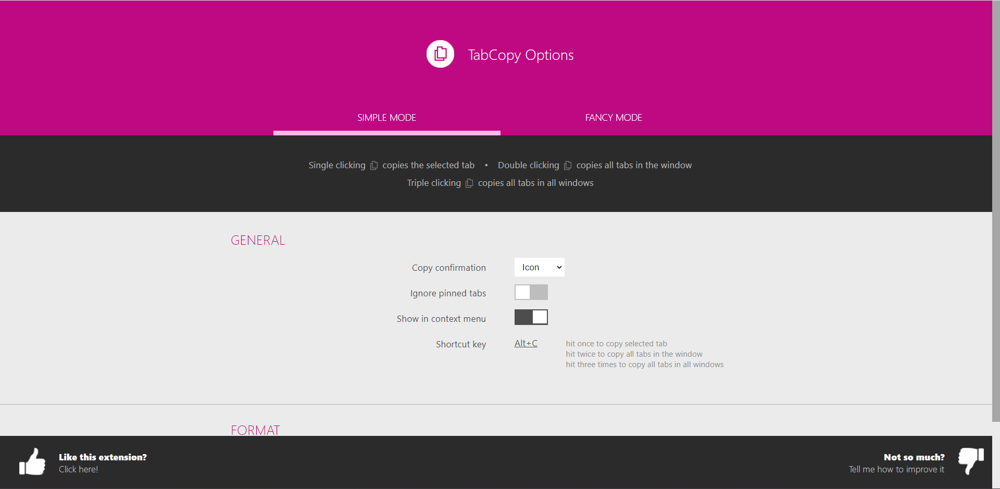
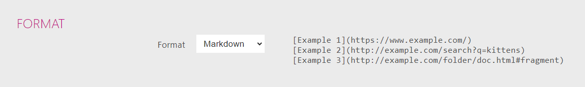
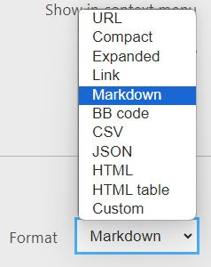
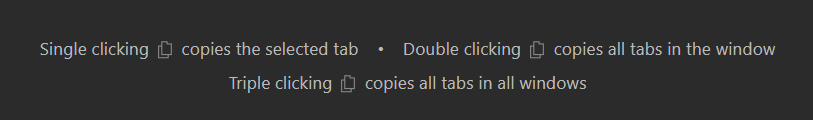
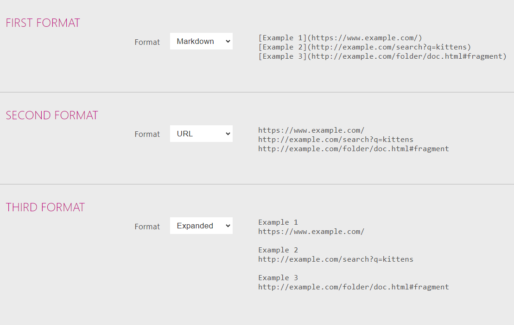
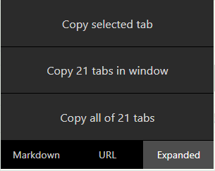

# [ 工具 ] TabCopy 一次複製多個頁面的標題和連結
因為最近開始寫部落格文章，常常會需要查找資料學習，並在文末附上參考資料和它們的連結。每次都要自己複製標題和連結，弄成 markdown 格式，實在太麻煩了！搜尋後發現 [TabCopy](https://chromewebstore.google.com/detail/tabcopy/micdllihgoppmejpecmkilggmaagfdmb){target="_blank"} 這個 chrome 套件，解決了我的煩惱～

## 設定步驟

1. 到套件 Options 進行設定。 

2. 設定分成 Simple Mode 和 Fancy Mode。Simple Mode 可以設定一種格式，Fancy Mode 可以設定三種。 

3. 以 Simple Mode 為例，點擊 Format 可以選擇不同格式。

## 使用教學
### Simple Mode

單擊套件按鈕會複製目前選擇的分頁，雙擊會複製該視窗所有分頁，三擊會~~煮菜~~複製所有視窗的所有分頁。

除了點擊套件按鈕，也可以使用快捷鍵 Alt+C。

### Fancy Mode
1. 設定好 1~3 種格式。

2-1. 單擊套件按鈕會跳出小視窗，分成兩個區塊。建議先在下面切換所需格式，再點擊上面選項複製目標分頁。

2-2. 一樣可以使用快捷鍵 Alt+C，但快捷鍵不會跳出小視窗，而是會判斷目前選擇的格式是哪一個，並複製目前所選分頁。